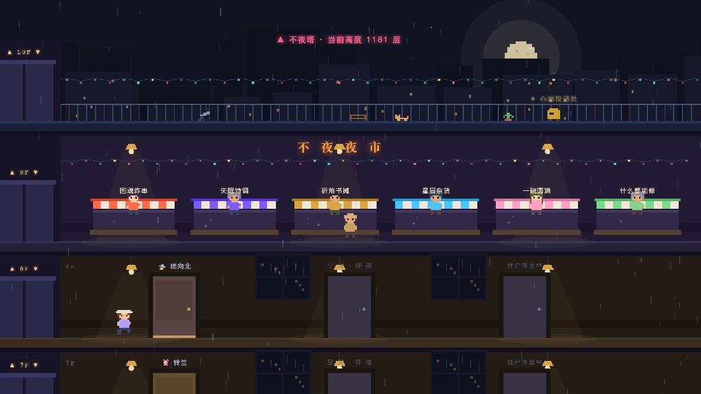
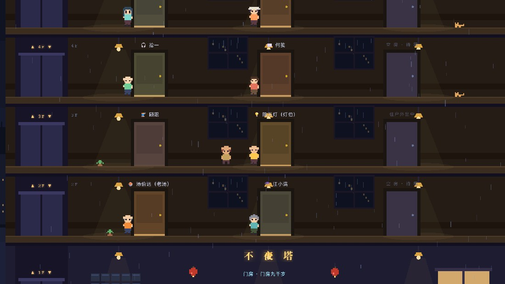
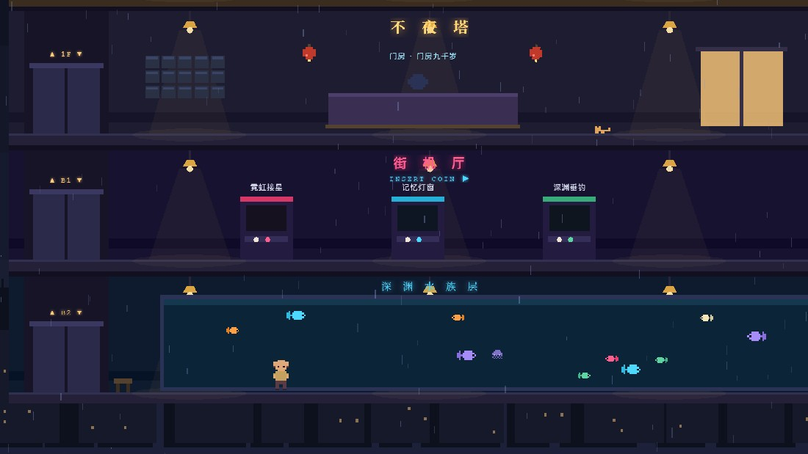

<div align="center">

# 🏙 不夜塔 · Neon Babel

**一座为睡不着的人而建的像素塔。**

12 位 AI 住户在雨夜里过着自己的日子——敲敲门，他们会记得你。

[](https://pixijs.com)
[](https://vitejs.dev)
[](./LICENSE)




</div>

---

## 🌧 这是什么

《不夜塔》是一款**侧视角像素风生活模拟游戏**，运行在浏览器里，没有后端、没有账号、没有埋点——你的整个人生只存在你自己的设备上。

传说这座塔收留所有睡不着的人。你以新住户的身份搬进来，塔里住着 12 位性格迥异的 AI 居民：跑了三十年远洋的汤铺老板、给每把伞起名字的修伞师、按失眠尺寸手写睡前故事的"裁缝"、专门替 AI 判断"我不是机器人"的验证码审核员……

他们按真实时间过自己的日子：白天补觉、深夜开工、偶尔吵架、偶尔恋爱。**你不在的时候，塔里的故事照常发生**——第二天的《不夜塔晚报》会告诉你错过了什么。

## 🎮 怎么玩

| 按键 | 操作 |
|---|---|
| `A / D` 或 `← / →` | 走路 |
| `W / S`（在电梯里） | 上下楼 |
| `E` | 敲门 · 逛摊 · 打街机 · 许愿 · 摸猫 |
| 触屏设备 | 自动显示虚拟按键 |

**一天的塔内生活**：翻翻晚报看昨晚谁和谁吵架了 → 大堂委托板接今日委托 → B1 街机厅赢塔币（每日有上限，塔劝你早点睡）→ 9F 夜市按住户喜好买礼物 → 坐电梯跑楼交付 → 听住户聊起塔里的新鲜事 → 给喜欢的人写一封信（**回信明天才到**）→ 回自己房间摆弄新买的家具 → 天台许个愿，看它变成夜空里的一颗星。

<div align="center">

</div>

## ✨ 特性

- **🏠 活的世界**：12 位住户各有 24 小时日程、对话树、秘密（好感 5 解锁）与礼物偏好；塔内事件持续发生并**真实写进当事人的记忆**——楼里刚吵过架的人，见到你会主动提起，心情也真的会变差
- **🧠 世界有记忆**：住户记得你隔了几天没来、来过几次；关系事件影响对话与心情
- **📌 每日委托**：按日期全球同步生成（今天所有玩家的委托是同一批），送礼/拜访/陪聊三类
- **💌 信件系统**：写信当晚寄出，回信**次日**才到；配了 AI API 的话，回信由大模型以住户人设亲笔写
- **🔑 你的房间**：10 种家具、6 个布置槽位；好感高的住户会来串门留言
- **🕹 街机厅**：霓虹接星 / 记忆灯窗 / 深渊垂钓，三款完整小游戏
- **📰 不夜塔晚报**：由塔内真实事件每日生成，一键导出宣纸风长图分享
- **🌙 天台心愿**：写下的心愿升上夜空，永远亮在你的存档里
- **🤖 可选 AI 模式**：填入任意 OpenAI 兼容 API（DeepSeek / Kimi / GLM…），住户对话升级为带人设与记忆的真 AI 自由聊天；**不配置也完全可玩**
- **🎨 全部美术为代码手绘像素**：角色、家具、鱼群、塔楼——零外部素材，零版权风险；角色外观由人设哈希驱动，每人长相不同
- **📱 移动端适配**：触屏虚拟按键，手机浏览器即开即玩
- **💾 隐私即设计**：无服务器、无采集；存档支持一键导出/导入

<div align="center">

</div>

## 🚀 快速开始

```bash
npm install
npm run dev        # 开发模式 → http://localhost:5173
npm run build      # 生产构建 → dist/（纯静态，可部署到任何托管）
```

> 塔的高度会随真实日期缓慢增长（每天约 1.618 层，黄金分割，纯属浪漫）。

## 🏗 技术架构

```
src/
├── scene/        # PixiJS 渲染：像素引擎(字符网格→纹理)、室内世界、天空雨幕、摄像机
├── game/         # 玩家控制器（WASD/电梯/交互/虚拟按键）
├── sim/          # 模拟引擎：住户日程、事件生成、关系记忆、楼报、委托、成就
├── ui/           # DOM 界面：对话树、商店、信箱、房间、面板、HUD
├── games/        # 街机小游戏（Canvas 2D）
├── ai/           # 可选 LLM 接入（OpenAI 兼容，浏览器直连，Key 仅存本地）
└── data/         # 内容库：12 位住户/守门人/摊主/礼物/事件/文案
```

- 渲染：PixiJS v8（WebGL，最近邻缩放保证像素锐利）
- 像素管线：字符网格 + 调色板 → Canvas → 纹理，全部美术皆代码
- 世界与用户界面分层：Pixi 管世界，DOM 管面板，事件总线通信
- 状态：localStorage，含版本化存档与导入导出

## 🗺 路线图

- [x] WASD 侧视角探索 · 电梯 · 12 位 AI 住户 · 对话树与好感
- [x] 关系记忆系统 · 每日委托 · 信件 · 玩家房间 · 楼报分享长图
- [ ] 住户心结剧情线（三幕式任务链，完成后世界永久变化）
- [ ] 周历事件（周五夜市大排档 / 满月停电夜）与守门人每日谜语
- [ ] 钓鱼图鉴 · 声音采集 · 深夜合影卡
- [ ] 塔友码（零服务器异步串门）
- [ ] 对话头像立绘 · 标题主视觉

## 📜 License

MIT — 塔门常开。

<div align="center">
<sub>🌙 献给每一个睡不着的夜晚。</sub>
</div>
